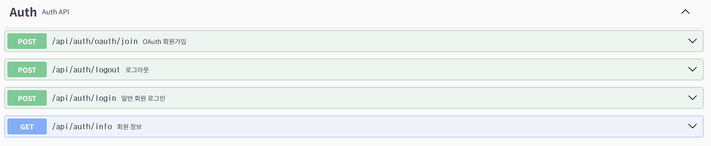
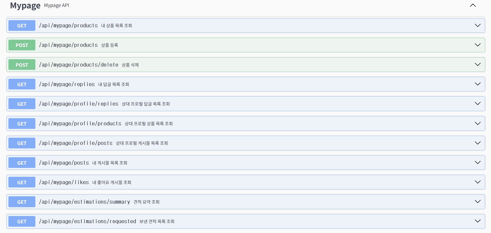
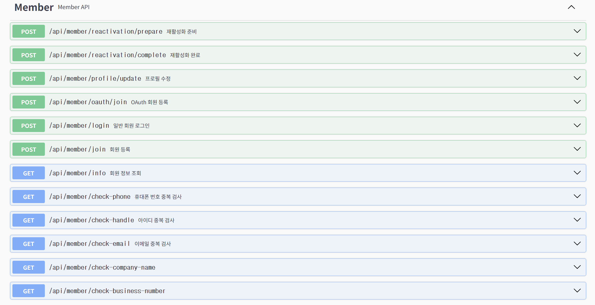
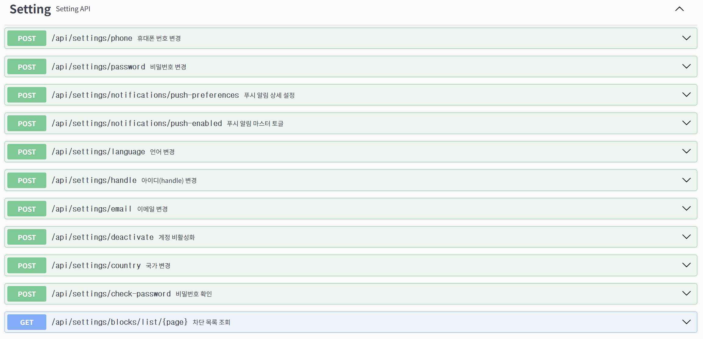

# 🌐 GlobalGates 담당 기능 소개

## 📌 개요

GlobalGates 프로젝트에서 제가 담당한 기능은 사용자가 서비스를 처음 시작하고, 이후 자신의 계정과 활동 정보를 관리하는 흐름입니다.

담당 범위는 크게 다음 세 가지입니다.

- 🔐 회원가입 / 로그인
- 👤 마이페이지
- ⚙️ 설정

---

## 🧩 담당 기능 요약

| 구분 | 주요 역할 |
|---|---|
| 🔐 회원가입 / 로그인 | 사용자가 서비스에 가입하고 인증된 사용자로 로그인할 수 있도록 처리 |
| 👤 마이페이지 | 사용자의 프로필, 상품, 게시글, 댓글, 좋아요 등 활동 내역 관리 |
| ⚙️ 설정 | 계정 정보, 알림, 언어, 국가, 차단 목록, 구독 상태 관리 |

---

# 🔐 1. 회원가입 / 로그인

회원가입과 로그인 기능은 사용자가 저희 서비스를 안전하게 시작할 수 있도록 구성한 영역입니다.

회원가입 과정에서는 사용자가 입력한 이메일, 전화번호, 사용자 아이디, 회사명, 사업자번호 등이 이미 사용 중인지 확인하도록 했습니다. 또한 이메일 인증과 SMS 인증을 통해 사용자가 실제로 접근 가능한 연락처를 사용하는지 검증할 수 있도록 구성했습니다.

로그인 이후에는 JWT 기반 인증 방식을 사용하여, 사용자가 마이페이지나 설정 페이지 같은 개인 기능에 접근할 때 로그인한 사용자인지 확인하도록 했습니다.

---

## ✅ 주요 기능

- 회원가입
- 로그인
- 이메일 중복 확인
- 전화번호 중복 확인
- 사용자 아이디 중복 확인
- 회사명 / 사업자번호 중복 확인
- SMS 인증
- 이메일 인증
- 프로필 이미지 등록
- SNS 로그인 후 추가 정보 입력
- 비활성 계정 다시 사용하기

---

## 🧭 사용자 흐름

1. 사용자가 회원가입 화면에 진입합니다.
2. 이메일, 전화번호, 사용자 아이디 등 기본 정보를 입력합니다.
3. 입력한 정보가 이미 사용 중인지 중복 확인을 진행합니다.
4. 전화번호 또는 이메일 인증을 통해 실제 사용 가능한 연락처인지 확인합니다.
5. 필요에 따라 프로필 이미지를 등록합니다.
6. 회원가입이 완료되면 로그인할 수 있습니다.

---

## 🪪 JWT 로그인 방식

로그인에 성공하면 서버는 사용자에게 JWT 토큰을 발급합니다.

JWT는 사용자가 로그인했다는 것을 확인해주는 디지털 출입증과 같은 역할을 합니다. 사용자는 이후 마이페이지, 설정 페이지 등 인증이 필요한 기능에 접근할 때 이 토큰을 함께 전달하고, 서버는 토큰을 검증하여 로그인한 사용자인지 확인합니다.

JWT는 서버의 서명을 통해 위조 여부를 검증할 수 있기 때문에, 사용자가 임의로 토큰 내용을 바꾸거나 다른 사용자처럼 요청하는 것을 방지하는 데 도움이 됩니다.

---

## 🔗 SNS 로그인 처리

SNS 로그인만으로는 저희 서비스에서 필요한 정보를 모두 확보하기 어렵습니다.

SNS에서는 주로 이름이나 이메일 정도의 기본 정보만 받을 수 있지만, 저희 서비스에서는 사업자 정보, 사용자 아이디, 관심 분야 등 서비스 이용에 필요한 추가 정보가 필요합니다.

따라서 SNS 로그인 이후에도 저희 서비스에서 필요한 정보를 한 번 더 입력하도록 구성했습니다.

---

## 🛠️ 구현 시 신경 쓴 부분

- 중복 가입을 방지하기 위한 이메일, 전화번호, 사용자 아이디 검증
- 실제 사용 가능한 연락처인지 확인하기 위한 이메일 / SMS 인증
- JWT 기반 인증을 통한 로그인 사용자 확인
- SNS 로그인 사용자를 위한 추가 정보 입력 흐름 분리
- 비활성 계정 사용자가 다시 서비스를 이용할 수 있는 흐름 구성

---

## 🖼️ 화면 / Swagger

---

# 👤 2. 마이페이지

마이페이지는 사용자가 자신의 프로필과 활동 내역을 확인하고 관리하는 공간입니다.

내 마이페이지에서는 프로필 수정, 상품 관리, 게시글 및 댓글 확인 등의 기능을 사용할 수 있습니다. 반면 다른 사용자의 마이페이지에 들어갔을 때는 팔로우, 차단, 신고, 채팅 이동과 같은 상호작용 기능을 사용할 수 있도록 구성했습니다.

즉, 같은 마이페이지 화면이라도 조회 대상이 본인인지 다른 사용자인지에 따라 제공되는 기능이 다르게 동작하도록 설계했습니다.

---

## ✅ 주요 기능

- 내 프로필 보기
- 다른 사용자 피드 보기
- 프로필 이미지 변경
- 배너 이미지 변경
- 내 상품 목록 보기
- 내 게시글 보기
- 내가 쓴 댓글 보기
- 좋아요한 게시글 보기
- 견적 요청 내역 보기
- 상품 등록
- 상품 삭제
- 팔로우 / 언팔로우
- 차단
- 신고

---

## 🧭 사용자 흐름

1. 사용자가 로그인 후 마이페이지에 진입합니다.
2. 내 프로필과 활동 내역을 확인합니다.
3. 상품, 게시글, 댓글, 좋아요 탭을 이동하며 자신의 활동을 확인합니다.
4. 프로필 수정 화면에서 닉네임, 소개글, 프로필 이미지, 배너 이미지를 변경할 수 있습니다.
5. 등록한 상품을 확인하거나 삭제할 수 있습니다.
6. 다른 사용자의 마이페이지에서는 팔로우, 차단, 신고를 사용할 수 있습니다.

---

## 🛠️ 구현 시 신경 쓴 부분

마이페이지는 본인 페이지와 다른 사용자 페이지가 서로 다르게 동작해야 했습니다.

본인 페이지에서는 수정과 관리 기능이 필요하고, 다른 사용자 페이지에서는 팔로우, 차단, 신고, 채팅 같은 상호작용 기능이 필요합니다. 따라서 조회 대상과 로그인 사용자를 비교하여, 상황에 따라 버튼과 기능이 다르게 보이도록 구성했습니다.

또한 마이페이지에는 상품, 게시글, 댓글, 좋아요 등 확인할 수 있는 정보가 많기 때문에 탭 구조로 나누어 정리했습니다. 이를 통해 사용자가 원하는 활동 내역을 빠르게 찾을 수 있도록 했습니다.

---

## 🔄 마이페이지 기능 구분

| 구분 | 제공 기능 |
|---|---|
| 👑 내 마이페이지 | 프로필 수정, 상품 관리, 게시글 확인, 댓글 확인, 좋아요 확인 |
| 👥 다른 사용자 마이페이지 | 팔로우, 언팔로우, 차단, 신고, 채팅 이동 |

---

## 🖼️ 화면 / Swagger

---

# ⚙️ 3. 설정

설정 페이지는 사용자가 가입 이후에도 자신의 계정 정보와 서비스 이용 환경을 직접 관리할 수 있는 공간입니다.

전화번호, 이메일, 사용자 아이디 같은 기본 계정 정보뿐만 아니라 알림, 언어, 국가, 차단 목록, 구독 상태도 설정할 수 있도록 구성했습니다.

개인정보와 관련된 기능이 많기 때문에, 중요한 정보 변경 시에는 중복 확인, 인증, 현재 비밀번호 확인 등의 절차를 거치도록 했습니다.

---

## ✅ 주요 기능

- 사용자 아이디 변경
- 전화번호 변경
- 이메일 변경
- 비밀번호 변경
- 계정 비활성화
- 알림 켜기 / 끄기
- 세부 알림 설정
- 언어 변경
- 국가 변경
- 차단한 사용자 목록 보기
- 차단 해제
- 구독 상태 확인
- 구독 해지

---

## 🧭 사용자 흐름

1. 사용자가 설정 페이지에 진입합니다.
2. 현재 계정 정보를 확인합니다.
3. 사용자 아이디, 전화번호, 이메일을 변경할 수 있습니다.
4. 비밀번호를 변경할 수 있습니다.
5. 알림을 켜거나 끌 수 있습니다.
6. 필요한 알림만 받을 수 있도록 세부 알림을 설정할 수 있습니다.
7. 차단한 사용자 목록을 확인하고 차단을 해제할 수 있습니다.
8. 구독 상태를 확인하거나 구독 해지를 진행할 수 있습니다.

---

## 🛠️ 구현 시 신경 쓴 부분

설정 페이지는 사용자의 개인정보와 계정 상태를 다루는 기능이 많기 때문에, 인증된 사용자 본인만 정보를 변경할 수 있도록 구성했습니다.

이메일과 전화번호처럼 중복 가능성이 있는 정보는 변경 전 중복 확인과 인증 절차를 거치도록 했습니다. 비밀번호 변경, 계정 비활성화, 구독 해지처럼 계정 상태에 직접적인 영향을 주는 기능은 발표 중 실수로 실행되지 않도록 시연 대상에서 제외했습니다.

발표에서는 안정적으로 보여줄 수 있는 기능을 중심으로 시연하고, 외부 인증이나 실제 계정 상태 변경이 필요한 기능은 설명으로 대체할 예정입니다.

---

## 🖼️ 화면 / Swagger

---

# 🧱 구현 중점 사항

이번 담당 기능을 구현하면서 중점적으로 고려한 부분은 다음과 같습니다.

- 사용자가 안전하게 가입하고 로그인할 수 있는 인증 흐름 구성
- 중복 가입과 잘못된 정보 입력을 방지하기 위한 검증 절차 적용
- JWT 기반 인증을 통한 로그인 사용자 확인
- SNS 로그인 사용자와 일반 회원가입 사용자의 흐름 분리
- 본인 마이페이지와 다른 사용자 마이페이지의 기능 분리
- 개인정보 변경 시 인증 및 확인 절차 적용
- 발표 시 안정적인 시연이 가능하도록 기능별 시연 범위 구분

---

